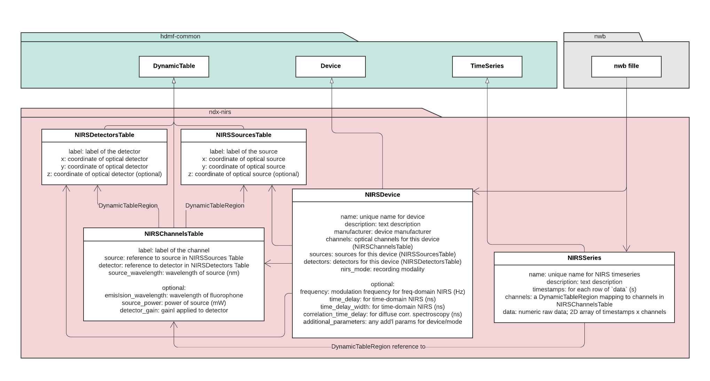

Overview
========

Introduction
------------
This is an NWB extension for storing near-infrared spectroscopy (NIRS) data. 

NWB NIRS data architecture
--------------------------

The two principal neurodata types of this extension are ``NIRSDevice``, which holds information about the NIRS hardware and software configuration, and ``NIRSSeries``, which contains the timeseries data collected by the NIRS device.

``NIRSSourcesTable``, ``NIRSDetectorsTable``, and ``NIRSChannelsTable`` are children of ``NIRSDevice`` which describe the source and detector layout as well as the wavelength-specific optical channels that are measured.

Each row of ``NIRSChannelsTable`` represents a specific source and detector pair along with the source illumination wavelength (and optionally, in the case of fluorescent spectroscopy, the emission/detection wavelength). The channels in this table correspond have a 1-to-1 correspondence with the data columns in ``NIRSSeries``.

Extension Spec
--------------
1. ``NIRSSourcesTable`` stores rows for each optical source of a NIRS device. ``NIRSSourcesTable`` includes:
    - ``label`` - the label of the source
    - ``x``, ``y``, and ``z`` - the coordinates of the optical source (``z`` is optional)

2. ``NIRSDetectorsTable`` stores rows for each of the optical detectors of a NIRS device. ``NIRSDetectorsTable`` includes:
    - ``label`` - the label of the detector
    - ``x``, ``y``, and ``z`` - the coordinates of the optical detector (``z`` is optional)

3. ``NIRSChannelsTable`` stores rows for each physiological channel, which is defined by source-detector pairs, where sources & detectors are referenced via ``NIRSSourcesTable`` and ``NIRSDetectorsTable``. ``NIRSChannelsTable`` includes:
    - ``label`` - the label of the channel
    - ``source`` - a reference to the optical source in ``NIRSSourcesTable``
    - ``detector`` - a reference to the optical detector in ``NIRSDetectorsTable``
    - ``source_wavelength`` - the wavelength of light in nm emitted by the source for this channel
    - ``emission_wavelength`` - the wavelength of light in nm emitted by the fluorophone (optional; only used for fluorescent spectroscopy)
    - ``source_power`` - the power of the source in mW used for this channel (optional)
    - ``detector_gain`` - the gain applied to the detector for this channel (optional)
    
4. ``NIRSDevice`` defines the NIRS device itself and includes:
    - ``channels`` - a table of the optical channels available on this device (references ``NIRSChannelsTable``)
    - ``sources`` - the optical sources of this device (references ``NIRSSourcesTable``)
    - ``detectors`` - the optical detectors of this device (references ``NIRSDetectorsTable``)
    - ``nirs_mode`` - the mode of NIRS measurement performed with this device (e.g., 'continuous-wave', 'frequency-domain', etc.)

   ``NIRSDevice`` also includes several optional attributes to be used in parallel with specific ``nirs_mode`` values:
    - ``frequency`` - the modulation frequency in Hz for frequency domain NIRS (optional)
    - ``time_delay`` - the time delay in ns used for gated time domain NIRS (TD-NIRS) (optional)
    - ``time_delay_width`` - the time delay width in ns used for gated time domain NIRS (optional)
    - ``correlation_time_delay`` - the correlation time delay in ns for diffuse correlation spectroscopy NIRS (optional)
    - ``correlation_time_delay_width`` - the correlation time delay width in ns for diffuse correlation spectroscopy NIRS (optional)
    - ``additional_parameters`` - any additional parameters corresponding to the NIRS device/mode that are useful for interpreting the data

5. ``NIRSSeries`` stores the actual timeseries data collected by the NIRS device
    - ``name`` - a unique name for the NIRS timeseries
    - ``description`` - a description of the NIRS timeseries
    - ``timestamps`` - the timestamps for each row of ``data`` in seconds
    - ``channels`` - a ``DynamicTableRegion`` mapping to the appropriate channels in a ``NIRSChannelsTable``
    - ``data`` - the actual numeric raw data measured by the NIRS system. It is a 2D array where the columns correspond to ``channels`` and the rows correspond to ``timestamps``

This extension was developed by Sumner L Norman, Darin Erat Sleiter, and José Ribeiro.
